# TRACE Architecture · Complete Schema

## ▎Physical View

```
┌─────────────────────────────────────────────────────────────────┐
│                        BROWSER (PWA)                             │
│                                                                  │
│  trace.html — Mother App (HTML + external JS modules + CSS)     │
│             Inline JS extracted to src/auth.js + src/sse.js      │
│                                                                  │
│  src/ │ 29 modules loaded in dependency order                    │
│       │                                                          │
│  SW   │  trace_sw.js — Service Worker (offline cache + sync)    │
│       │                                                          │
│  Store │  IndexedDB (primary) + localStorage (backup)            │
│       │                                                          │
│  Env  │  trace.css + manifest.json + Google Fonts               │
├─────────────────────────────────────────────────────────────────┤
│                         SERVER (Node.js)                         │
│                                                                  │
│  trace_server.js — HTTP + API proxy + static file serving        │
│                                                                  │
│  trace_cluster.js — Process manager (health, restart, drain)     │
│                                                                  │
│  routes/ │ 8 route modules                                       │
│                                                                  │
│  DB      │  better-sqlite3 (WAL mode)                           │
│                                                                  │
│  Env     │  ANTHROPIC_API_KEY, STRIPE_*, ADMIN_SECRET, PORT      │
└─────────────────────────────────────────────────────────────────┘
```

## ▎Module Dependency Graph

```
LOAD ORDER:     WHAT IT DOES:
                       
types.js        → JSDoc type definitions (no runtime effect)
auth.js         → Auth client (login, register, token verify) [in <head>]
sse.js          → SSE real-time event client [at bottom of <body>]
utils.js        → HTML escaping, toast, clock, empty TL builder
dom.js          → DomBuilder fluent DOM construction API
i18n.js         → Internationalization (multi-language support)
tiers.js        → 3-tier config (features, nav, prompts, colors)
registry.js     → Plugin system (hooks, screens, commands)
nav.js          → Screen navigation, d-pad, keyboard shortcuts
persistence.js  → Load/save timelines to IndexedDB ↔ localStorage
scan.js         → File picker, camera capture, AI analysis trigger
chat.js         → Message UI, conversation with AI context
cases.js        → Case management, add/remove/investigation cards
results.js      → Render analysis result, bookmarks, zoom
timeline.js     → Ownership chain (horizontal strip + vertical grid)
vision.js       → 7 sub-modules (gap, valuation, research, fingerprint, etc.)
geometry.js     → Canvas overlays (golden ratio, thirds, spiral, symmetry)
viewer.js       → IIIF Deep Zoom / OpenSeadragon tile viewer
export.js       → PDF, CIDOC-CRM, case JSON generation
knowledge.js    → Canvas force-directed provenance graph
idb.js          → IndexedDB CRUD, 7 object stores (auto-init)
sync.js         → Sync compatibility layer (delegates to offline.js)
upload.js       → Drag-and-drop, PDF extraction, batch queue (auto-init)
csv_import.js   → Getty Provenance Index CSV parser
hw.js           → WebUSB, Bluetooth, Serial device connection
watchdog.js     → Self-healing: error batch + report to server
intro.js        → Canvas animation (3.5s logo → content reveal)
camera.js       → Camera overlay UI, torch, grid, capture roll
compare.js      → Side-by-side, overlay, and split comparison
app.js          → Bootstrap: set tier, load data, register SW, start clock
```

## ▎Screen Map (per tier)

| Screen | Discover (Free) | Collector (€49/mo) | Professional (€299/mo) |
|--------|-----------------|-------------------|----------------------|
| intro | Animated logo → tagline → begin | Same intro, different text | Same intro, professional text |
| home | Greeting + scan CTA + fun facts | Cases preview + scan CTA | Dashboard + alerts + cases |
| scan | Upload/photograph + AI story | Upload + full provenance | Upload + deep provenance |
| chat | 5/day limit | Unlimited + context-aware | Unlimited + institutional |
| cases | — locked — | Case cards + filters | Case cards + filters + export |
| timeline | — locked — | Ownership chain + search | Full chain + gap analysis |
| learn | 5 art history lessons | — not shown — | — not shown — |
| research | — locked — | — locked — | Agent-driven investigation |
| spectral | — locked — | — locked — | UV/IR/X-Ray layer blending |
| geometry | — locked — | Golden ratio + overlays | Golden ratio + overlays |
| viewer | — locked — | — locked — | IIIF Deep Zoom tile viewer |
| knowledge | — locked — | Provenance graph | Provenance graph |
| profile | Tier badge + upgrade | Plan + stats + exports | Plan + API key + exports |

## ▎Bottom Nav Bar (per tier)

```
DISCOVER:     [Home] [Scan] [Chat] [Learn] [Profile]

COLLECTOR:    [Home] [Scan] [Chat] [Cases] [Timeline] [Geometry] [Graph] [Profile]

PROFESSIONAL: [Home] [Scan] [Chat] [Cases] [Timeline] [Research] [Zoom] [Graph] [Profile]
```

## ▎Data Flow (end-to-end scan)

```
User uploads/photographs image
        │
        ▼
scan.js:   img64 + imgType stored → preview shown
        │
        ▼
scan.js:   POST /analyse → trace_server.js → api.anthropic.com
        │                                          │
        │                                   [Claude Sonnet 4]
        │                                          │
        │                              ← JSON result with:
        │                                 title, artist, period, timeline[],
        │                                 style_analysis, confidence, etc.
        ▼
results.js:  Renders result → saves to localStorage + IndexedDB
        │
        ▼ (hooks fire)
        │
vision.js:   Gap severity → Valuation → Digital fingerprint → Forensic → DB query
geometry.js: Auto-loads scan image for overlay analysis
knowledge.js: Builds provenance graph from timeline data
offline.js:  LocalStorage sync queue (sole queue owner)
sync.js:     Delegates to offline.js (compatibility layer)
```

## ▎Server API Routes

```
GET  /health                          → Server health + config status
GET  /api/debug                       → Full self-diagnosis
POST /analyse                         → Anthropic API proxy
POST /api/create-checkout-session     → Stripe Checkout
POST /api/stripe-webhook              → Stripe webhook handler
POST /api/subscribe                   → License key creation (needs adminToken)
POST /api/verify-subscription         → HMAC-signed token verification
GET  /api/subscription-status         → Active subscription list
POST /api/interpol-check              → Stolen database cross-reference
GET  /api/bulk-export                 → CSV/JSON batch export
GET  /api/timeline/list               → Server-side timeline list
POST /api/timeline/save               → Save timeline to server
POST /api/timeline/delete             → Delete from server
POST /api/provenance/cross-reference  → All 5 databases (Getty, INTERPOL, etc.)
POST /api/provenance/getty-search     → Getty ULAN artist search
POST /api/provenance/knowledge-graph  → Build graph nodes/edges
POST /events                          → Telemetry event logging
GET  /events                          → Recent event list
GET/POST /api/ops/*                   → AI self-diagnosis endpoints
     * /health-check, /log, /auto-fix, /report
```

## ▎Persistence Strategy

| Store | IndexedDB (primary) | localStorage (backup) |
|-------|--------------------|-----------------------|
| timelines/store | `IDB.saveTimeline()` | localStorage fallback |
| cases | 7 object stores | JSON string |
| results | result store | `trace_lastResult` key |
| sync_queue | `IDB.queueSyncOp()` | `trace_sync_queue` key |
| bookmarks | store | `trace_bookmarks` key |
| annotations | store | `trace_annotations` key |

**Migration:** On first load, IDB automatically migrates existing localStorage data
**Fallback:** If IDB unavailable → transparent fallback to localStorage

## ▎Self-Healing (trace_cluster.js)

```
MASTER PROCESS
│
├── Forks N workers (default: CPU count)
├── Health pings every 10s
├── Worker unresponsive 8s → auto-restart
├── Crash → auto-restart (max 5/60s, then 30s cooldown)
└── File changes (--watch) → rolling restart (new worker first, drain old)
        │
        ▼
WORKER PROCESS (trace_server.js)
│
├── Active connection tracking (Set)
├── Graceful shutdown: drain connections (8s) → force exit (12s)
├── Reports health to master every 10s
└── On crash, signals master before exit
```

## ▎Subscription Security Model

```
1. License keys (TRACE-XXXX-XXXX-XXXX-XXXX)
   Created ONLY via: adminPanel (ADMIN_SECRET) or Stripe webhook
2. Tokens are HMAC-SHA256 signed with SUBSCRIPTION_SECRET
3. Client verifies via POST /api/verify-subscription
4. Rate limits enforced per token tier
```

## ▎PWA Offline Strategy

| Strategy | Static Assets | API Responses | Sync Queue |
|----------|--------------|---------------|------------|
| Pattern | Cache-first | Network-first | Background sync |
| Behavior | Pre-cached on install | Cached on success | Queues mutations |
| Benefit | Instant load offline | Read cached results | Replays when online |
| Maintenance | SW auto-updates hourly | Stale-while-revalidate | Client localStorage → server |

## ▎Scripts — Development Tooling

| Script | Purpose |
|--------|---------|
| `restart.sh` | Server auto-recovery — kill existing process, verify DB, start cluster mode, health check |
| `build_apps.sh` | Build helper |
| `scripts/launch_brave.sh` | Brave Browser launcher with Shields/fingerprinting bypass for local development |
| `scripts/setup_spotlight_exclusions.sh` | Exclude build/cache dirs from Spotlight indexing (macOS) |
| `scripts/test_all_voices.py` | Voice test suite |

### Brave Browser Launcher (`scripts/launch_brave.sh`)

Brave Browser blocks certain features that TRACE needs:
- **Brave Shields** — blocks `fetch()`/XHR requests to `localhost` APIs
- **Farbling** — adds noise to Canvas output, breaking canvas-based features (intro animation, geometry overlays, camera viewfinder)
- **Localhost Permission** — restricts pages from accessing local services
- **Service Workers** — blocked on `file://` protocol (PWA offline mode)

The launcher script solves this by:
1. **Auto-detecting** the Brave binary on macOS, Linux, Windows (including Flatpak/Snap/Git Bash)
2. **Verifying** the TRACE server is running on the target port
3. **Creating a disposable temp profile** with a pre-configured `Preferences` JSON that disables Shields and fingerprinting for `localhost:<port>`
4. **Launching Brave** with flags that maximise TRACE compatibility:
   - `--unsafely-treat-insecure-origin-as-secure=http://localhost:PORT` — enables Service Workers on localhost
   - `--no-first-run` — skips the welcome page
   - `--start-maximized` — opens maximized

**Usage:**
```bash
./scripts/launch_brave.sh                    # Normal mode
./scripts/launch_brave.sh --auto             # Automation/CDP mode (port 9222)
./scripts/launch_brave.sh --kiosk            # Full-screen kiosk
./scripts/launch_brave.sh --incognito        # Private window
./scripts/launch_brave.sh --no-server        # Skip server health check
./scripts/launch_brave.sh --port 3001        # Custom port
./scripts/launch_brave.sh --verbose          # Debug output
```

The `--auto` flag enables Chrome DevTools Protocol debugging on port 9222, disables automation detection (`--disable-blink-features=AutomationControlled`), and adds `--no-sandbox` on Linux — making it suitable for browser automation agents.

**Limitations:**
- Brave Shields cannot be fully disabled via CLI flags — the script works around this by pre-writing the Preferences JSON before the first launch
- On Brave updates, the Preferences file structure may change; the script may need updating
- For pure automation, standard Chrome/Chromium is more reliable (no privacy layer interference)

---

## ▎Mermaid Diagram

```mermaid
graph TB
    subgraph BROWSER["Browser (PWA)"]
        HTML["trace.html<br/>Mother App"]
        SUB_MOD["trace_subscription.js<br/>Subscription Manager"]
        SW["trace_sw.js<br/>Service Worker"]
        IDB_STORE["IndexedDB<br/>Primary Store"]
        LS["localStorage<br/>Backup"]
        
        subgraph MODULES["29 Source Modules"]
            AUTH["auth<br/>Auth Client"]
            SSE["sse<br/>SSE Events"]
            U["utils<br/>Helpers"]
            DOM["dom<br/>DomBuilder"]
            I18N["i18n<br/>Internationalization"]
            TI["tiers<br/>Config"]
            R["registry<br/>Plugin System"]
            N["nav<br/>Navigation"]
            P["persistence<br/>Store Layer"]
            S["scan<br/>Upload + Analyse"]
            C["chat<br/>AI Chat"]
            CA["cases<br/>Case Mgmt"]
            RE["results<br/>Result Render"]
            TL["timeline<br/>Provenance Chain"]
            V["vision<br/>Analysis Suite"]
            G["geometry<br/>Sacred Geometry"]
            VW["viewer<br/>IIIF Viewer"]
            E["export<br/>PDF/CIDOC"]
            K["knowledge<br/>Graph"]
            IDB_MOD["idb<br/>IndexedDB API"]
            SY["sync<br/>Sync Engine"]
            UPL["upload<br/>Drag & Drop"]
            CSV["csv_import<br/>Getty CSV Parser"]
            HW["hw<br/>Hardware (USB/BT)"]
            WD["watchdog<br/>Self-Healing"]
            IN["intro<br/>Animation"]
            CAM["camera<br/>Capture UI"]
            CMP["compare<br/>Comparison"]
            OF["offline<br/>PWA Install"]
            AP["app<br/>Bootstrap"]
        end
    end

    subgraph SERVER["Node.js Server"]
        CL["trace_cluster.js<br/>Process Manager"]
        SV["trace_server.js<br/>HTTP + API Proxy"]
        DB_MOD["trace_db.js<br/>SQLite ORM"]
        DB[("better-sqlite3<br/>WAL Mode")]
        
        subgraph ROUTES["8 Route Modules"]
            SUB["subscriptions<br/>Auth + Stripe"]
            AUTH["auth<br/>Register/Login/Verify"]
            AG["agent<br/>AI Watchdog + Fix"]
            EV["events<br/>Telemetry"]
            TIM["timeline<br/>Server Timelines"]
            HLP["helpers<br/>Shared Utils"]
            OPS["ops<br/>Self-Diagnosis"]
            PV["provenance<br/>Getty/INTERPOL/etc"]
        end
        
        subgraph ENV["Environment"]
            AK["ANTHROPIC_API_KEY"]
            SK["STRIPE_*"]
            AD["ADMIN_SECRET"]
            PT["PORT"]
        end
    end

    subgraph EXTERNAL["External Services"]
        ANTH["Anthropic Claude<br/>AI Analysis"]
        STRIPE["Stripe<br/>Payments"]
        GOOGLE["Google Fonts<br/>CDN"]
    end

    S -->|POST /analyse| SV
    SV -->|proxy| ANTH
    SV --> ROUTES
    DB_MOD --> DB
    ROUTES --> DB_MOD
    HTML --> AUTH
    HTML --> SSE
    HTML --> MODULES
    HTML --> SW
    HTML --> SUB_MOD
    P --> IDB_STORE
    P --> LS
    IDB_MOD --> IDB_STORE
    OF --> SW
    CL -->|forks| SV
    SUB -->|webhook| STRIPE
    AUTH -->|verify user| SUB
    AG -->|error patterns| OPS
    WD -->|POST /api/agent/report| AG
    CAM -->|capture| S
    CMP -->|canvas| S
    UPL -->|drop files| S
    K -->|timeline data| TL
    CSV -->|provenance data| PV
    G -->|scan image| S
    AP -->|init| MODULES
```



---

*Generated for TRACE Art Intelligence · Full architecture as of June 2026*
